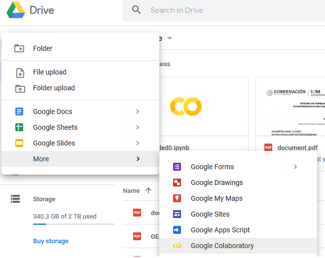
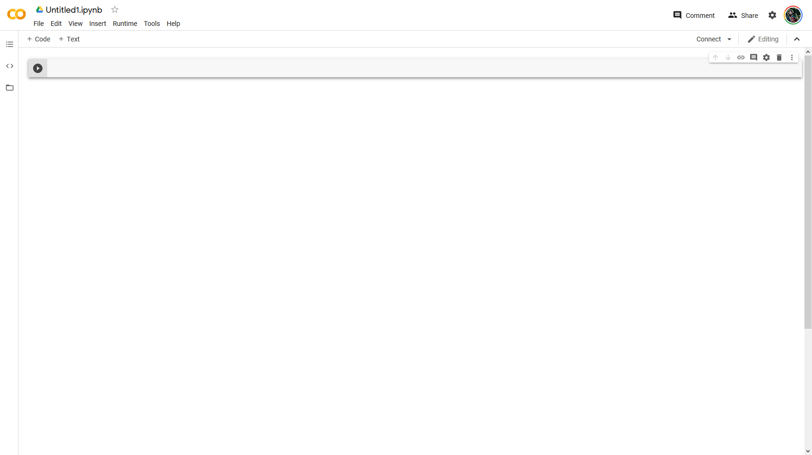
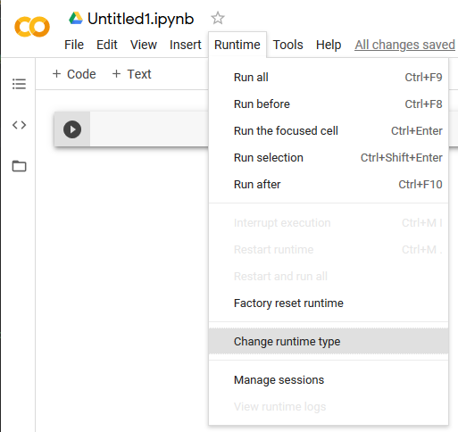
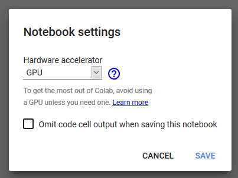
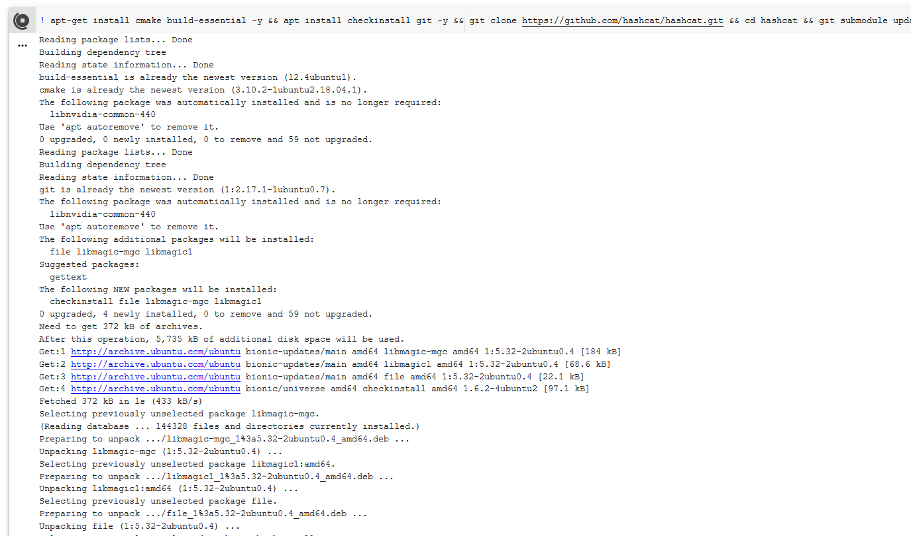
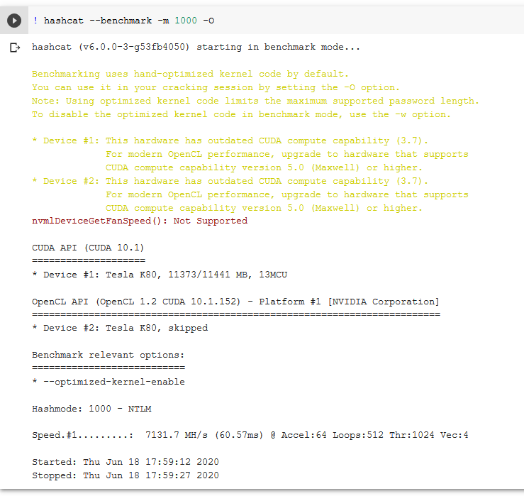
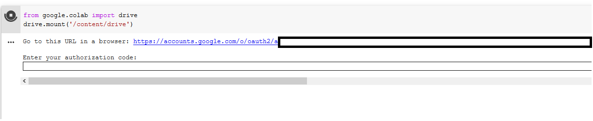
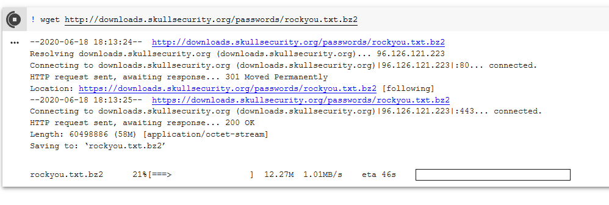
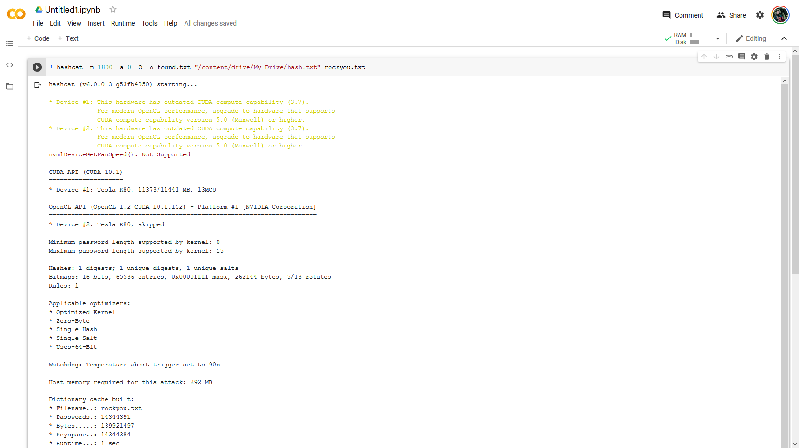
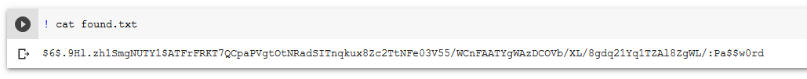

I know this may sound too good to be true, but trust me on this one ...


----

### [](#header-3)Intro to Google Colaboratory

Colaboratory, or "Colab" for short, allows you to write and execute Python in your browser, with

    Zero configuration required
    Free access to GPUs
    Easy sharing

<iframe width="560" height="315" src="https://www.youtube.com/embed/inN8seMm7UI" frameborder="0" allow="accelerometer; autoplay; encrypted-media; gyroscope; picture-in-picture" allowfullscreen></iframe>
<br>
From Google
"Colab notebooks allow you to combine executable code and rich text in a single document, along with images, HTML, LaTeX and more. When you create your own Colab notebooks, they are stored in your Google Drive account. You can easily share your Colab notebooks with co-workers or friends, allowing them to comment on your notebooks or even edit them. To learn more, see Overview of Colab. To create a new Colab notebook you can use the File menu above, or use the following link: create a new Colab notebook.

Colab notebooks are Jupyter notebooks that are hosted by Colab. To learn more about the Jupyter project, see jupyter.org."

Here is link to learn more:

 https://colab.research.google.com/notebooks/intro.ipynb#scrollTo=lSrWNr3MuFUS


### [](#header-3)Using Hashcat in Colab

Let's just dive into what we are going to do for now with colab... HASHCAT


If you don't know what hashcat is, why are you reading this??? I'm kidding, hashcat is a gpu accelerated password cracking tool. To learn more check out the project website:

https://hashcat.net


Ok... so let's get started on setting up hashcat in Colaboratory. It is super easy.

First we need to open up google drive and select new Colab Page




You will be greeted with a page similar to this one where we can begin configuring hashcat.




From here we need to ensure we select a GPU workspace and install hashcat.






To install hashcat we must issue the following:

```shellcode
! apt-get install cmake build-essential -y && apt install checkinstall git -y && git clone https://github.com/hashcat/hashcat.git && cd hashcat && git submodule update --init && make && make install
```

Click the Play Button and wait for the command to complete.



From here we can do a number of things. We can benchmark hashcat, we can mount our Google Drive to import hashes from there. We can do whatever. I will show some basic stuff with MD5 hash because that is fast to test :-D.

First, let's run a benchmark of NTLM and see what we've got going on here:

```shellcode
! hashcat --benchmark -m 1000 -O
```



Not bad for a free little tool I'd say.

From here let's do some testing. I'm going to create a Linux user and copy the hash file to Google drive.

First, let's create a user (if you don't want to, you can just copy and paste hashes and info from here)

```shellcode
$ sudo useradd -M test
```

We specify -M to prevent the command from making a home directory. Let’s create a password and then grab the user’s hash and learn about it.

```shellcode
$ sudo passwd test 
$ sudo grep test /etc/shadow 
```


I set my password to ‘Pa$$w0rd’. It is simple for this example and we can crack it very quickly with hashcat.

```shellcode
test:$6$.9Hl.zh1SmgNUTY1$ATFrFRKT7QCpaPVgtOtNRadSITnqkux8Zc2TtNFe03V55/WCnFAATYgWAzDCOVb/XL/8gdq21Yq1TZAl8ZgWL/:17947:0:99999:7:::
```

This is going into a new file called hash.txt that is being uploaded to the root of my Google Drive. From here we can mount Google Drive in our Colab doc and run hashcat. To mount drive do the following:

```shellcode
from google.colab import drive
drive.mount('/content/drive')
```



Follow the link and instructions to link your drive. Now that we are about to run hashcat on our colab, let's take another look at our test hash and break it down a bit.

Looking at this hash, $6$ indicates SHA512. The characters after the $6$ up to the next $ are the SALT. For me, that is .9Hl.zh1SmgNUTY1. To further verify what type of hash storage is on our system, we can look at the hash configuration in /etc/login.defs

```shellcode
$ sudo grep ENCRYPT_METHOD /etc/login.defs
```

This returns SHA512 in my case. If you want more details you can view the entire file. We need to sanitize our hash.txt file a bit to make it ready for hashcat also.

```shellcode
$ sudo grep test /etc/shadow > test.hash
```

Use your preferred editor to remove the username and colon following. We also need to remove the colons and extra characters at the end of the file. For me, the hash looks like this:

```shellcode
$6$.9Hl.zh1SmgNUTY1$ATFrFRKT7QCpaPVgtOtNRadSITnqkux8Zc2TtNFe03V55/WCnFAATYgWAzDCOVb/XL/8gdq21Yq1TZAl8ZgWL/
```

We now need a wordlist. I prefer the rockyou list as a base but you can start wherever you’d like. To download the rockyou list go to skullsecurity.org or just

```shellcode
! wget http://downloads.skullsecurity.org/passwords/rockyou.txt.bz2
! bunzip2 rockyou.txt.bz2
```



We have our hash and our wordlist. Let’s crack it!

```shellcode
! hashcat -m 1800 -a 0 -O -o found.txt "/content/drive/My Drive/hash.txt" rockyou.txt
```

Let’s break the command down a bit, -m specifies hash type, -a 0 tells hashcat we are doing a dictionary attack, -O tells hashcat to use the optimized opencl kernel, -o is output file, — remove will delete our hash from the original file.




To view the results ...

```shellcode
! cat found.txt
```




### [](#header-3)In Closing

You can obviously get more complex and can also use this for machine learning as well as a number of other tasks. The best part is that it is jupyter pages. LaTEX, Python, and a ton more are available. Play around, share, and enjoy.

For me, the most common use cases are for CTFs, quick tensorflow examples, or simple collab docs for things without sensitive information. A good use case is if I am showing someone how to do something quick in Python. I can write a guide where the code can literally be executed on the page for demonstration. 

Let me know what kinds of fun projects you start!