Docker on a Pi?! Yes, it works on Pi 4 and works well!!


----

### [](#header-3)What is Docker?

Docker is a set of platform as a service (PaaS) products that uses OS-level virtualization to deliver software in packages called containers. Containers are isolated from one another and bundle their own software, libraries and configuration files; they can communicate with each other through well-defined channels. All containers are run by a single operating system kernel and therefore use fewer resources than virtual machines.

Basically what that means is that Docker is applications on a set platform running in seperate containers based on the same infrastructure. Still don't get it... well, say you have a Raspberry Pi (as we do!!!) and you want to run a bunch of applications and things on it. You can do this with containers as long as the containers are built to run on the arm platform. You can have an Ubuntu container, PiHole container, etc. They will all run fine and in seperate containers just as you would run virtual machines.


----
### [](#header-3)Why use it on Raspberry Pi?

Well, running Docker on a Raspberry Pi gives you quite a bit of flexibility. A few use cases for me are homelab. You can setup a bunch of services in containers to beat up on, customize, etc and can easily just reset them when done. You could also setup services that you want in your network on a Pi. It is low power and you can isolate these services within containers. Example I use for this is Ubiquiti Unifi, PiHole, Nginx, Squid, etc.


----
### [](#header-3)Dockerizathinginator

Q: What is this annoyingly named thing you keep talking about?!

A: I'm glad you asked!! It's a little application I decided to write in Python using Eel (https://github.com/samuelhwilliams/Eel). Eel is a python library that allows you to write applications much like you can with electron, but with python instead of javascript. I chose this route because I had never used Eel and there is no better way to learn how to use something than to just go for it.

Q: Ok... well, what does it DO ALREADY?!

A: Oh, sorry. Well, this app automates installation of docker, logging configuration, backup configuration, and container configs. Currently it is only in Alpha release so not all features are implemented. Currently it will install log2ram, docker, portainer, and configure it all to install on the volume you specify.

Q: Cool! How do I get it and use it?!

A: It's on GitHub!! You can download source and play as you see fit OR you can just download the application on the release page. Here's both links! [Source](https://github.com/b34rdtek/dockerizathinginator) and [Alpha](https://github.com/b34rdtek/dockerizathinginator/releases/tag/ALPHA)

So... to use this piece of software it's really quite simple. You start it up, instert your Pi information, go through each page, verify all on Summary Page, then go!

----
### [](#header-3)Let's do this!

First we need to get ourselves a freshly imaged Raspberry Pi 4. If you don't have a Pi 4, you cannot use this software. Sorry. Once we have hardware in had, we need to download the latest version of Raspberry Pi OS and flash it to an sd card. I recommend the Lite version.


We can download the latest OS [here](https://www.raspberrypi.org/downloads/raspberry-pi-os/).

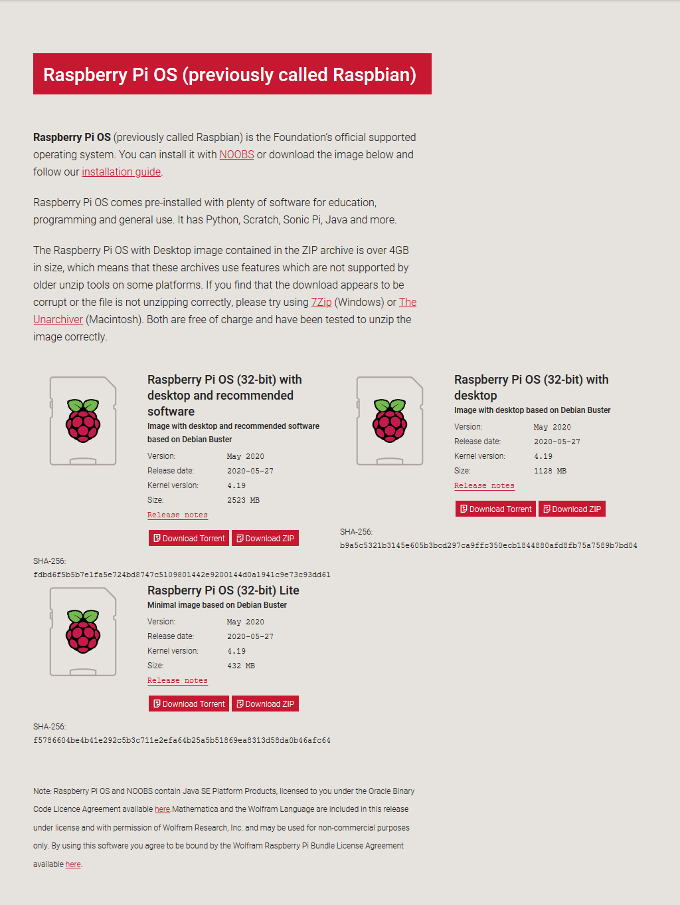

Once downloaded we flash to our micro sd card using whichever software we use. For Linux/Mac I recommend dd and for Windows I suggest Balena Etcher.

```bash
$ sudo dd if=/path/to/img of=/dev/usbdevice
```

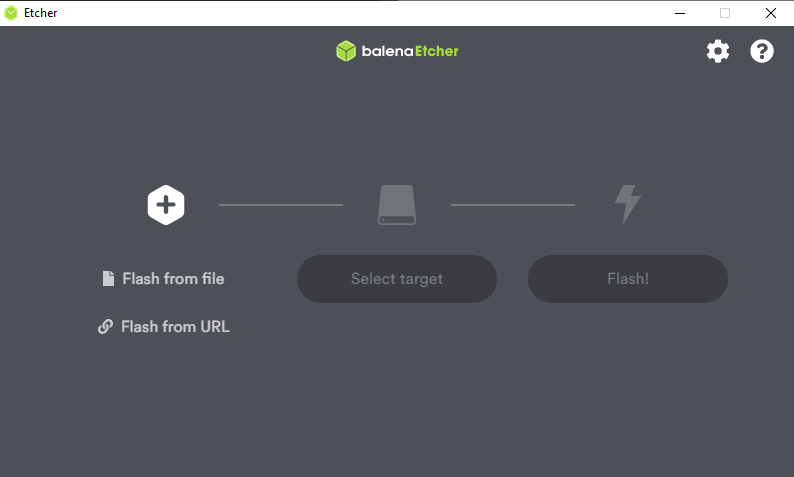

Once flashed we need to do two more things to our image. First, we need to create an empty file in the boot directory called ssh. Then we need to add a wpa_supplicant.conf file. Adding a blank ssh file is pretty simple. In Linux/Mac we just:

```bash
$ touch /mounted/sdcard/boot ssh
```

In Windows we can just right click and create new text document. Then we rename it to ssh.

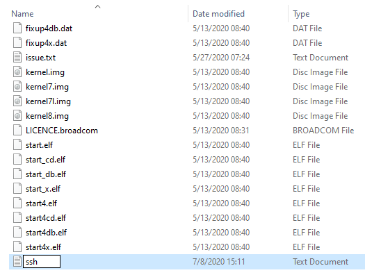

The wpa supplicant file needs a bit more stuff. We can touch the file or create a new text file like we did before and make sure it is named wpa_supplicant.conf. From here we open our favorite text editor and add the following:


You would obviously need to specify your country, your ssid, and the psk. What I like to do is use wpa_passphrase to generate one so I'm not actually putting my psk in plain text.

Once finished, unmount your sdcard, plug into your pi, and power on. Once on, get the IP address and ssh in to verify connectivity. From here we get to start using DOCKERIZATHINGINATOR!!

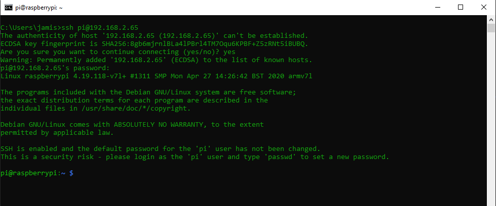

So, from here we put in our Pi hostname or IP Address. If we changed username or password we update that as well and click test connection. The current release is buggy and sometimes requires you to run the test twice.

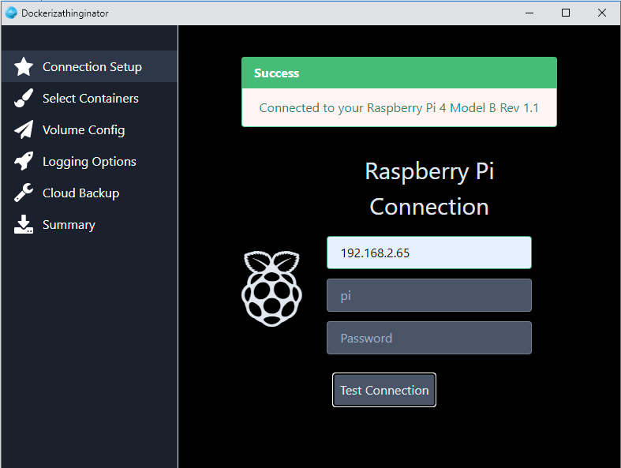

Let's move on to the next section, select containers. As of this release this part doesn't do anything. It will be implemented in ALPHA 0.2. We can still take a look and see what options there are.

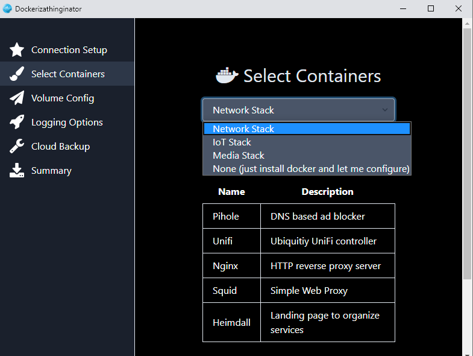

Let's move on to volume config. Here we can configure docker containers to be put in a specific folder with usb device mounted there or network shares. Here I'm going to demonstrate using a USB device. First, we select USB, specify the mount location, and click Prepare USB. The screen will update and give us current status of our device.

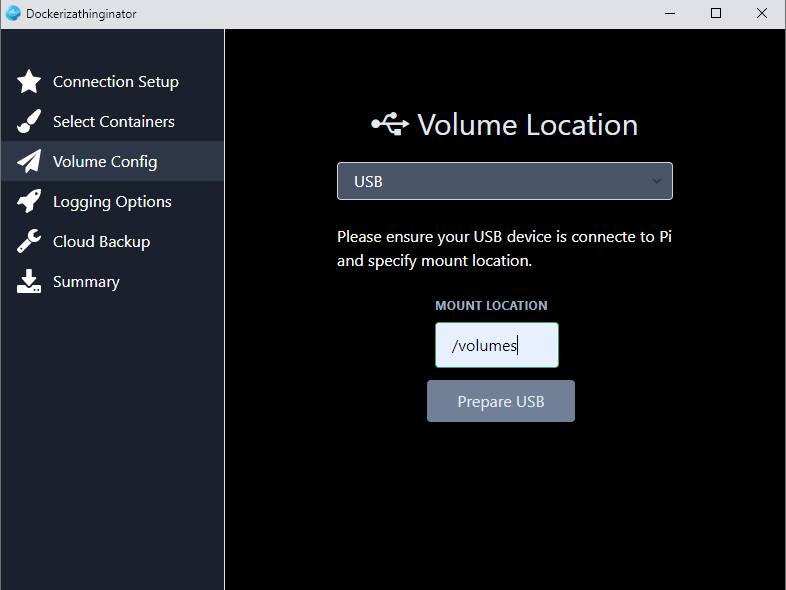

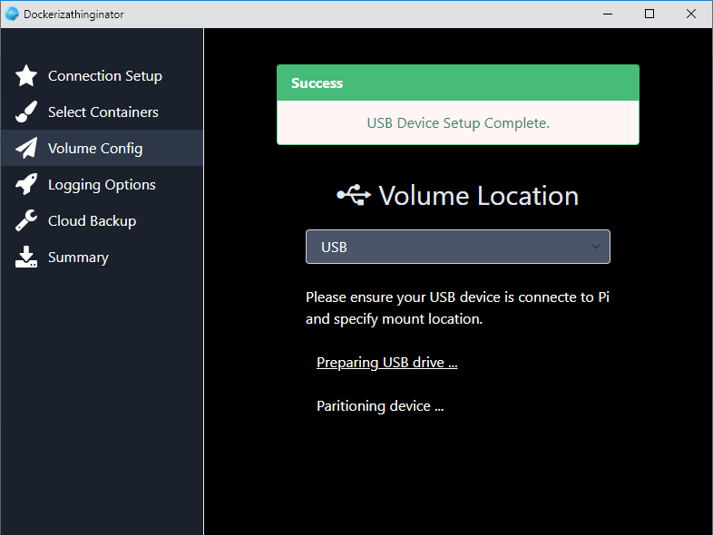

Ensure you only click the buttons once. The USB device will be wiped clean, partitioned, mounted to specified folder, and added to Pi fstab to remount on start. Now we can move on to Logging Options. Here we have three choices, Log2Ram, Log to Volume, or None. The only configured option is Log2Ram and no matter what you select here Log2Ram is what is done. This will extend the life of your sd card quite a bit.

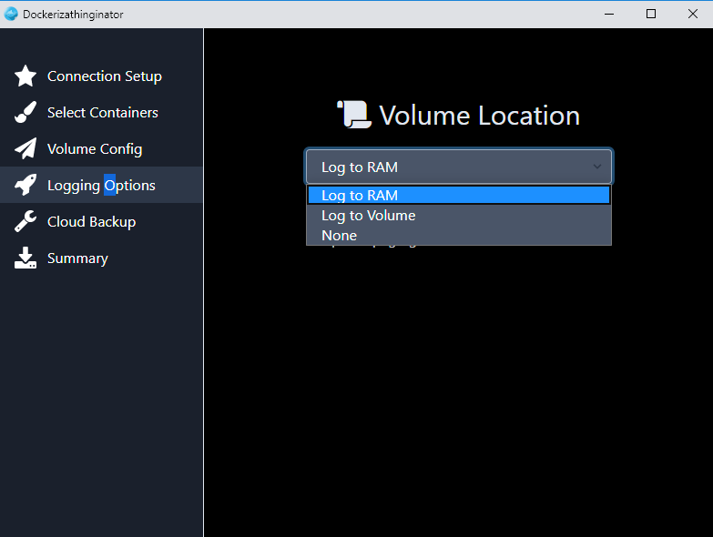

Moving on, we are now on the cloud backup pane. Again, this isn't fully configured yet. Github will do some things but ultimately doesn't work completely yet. 

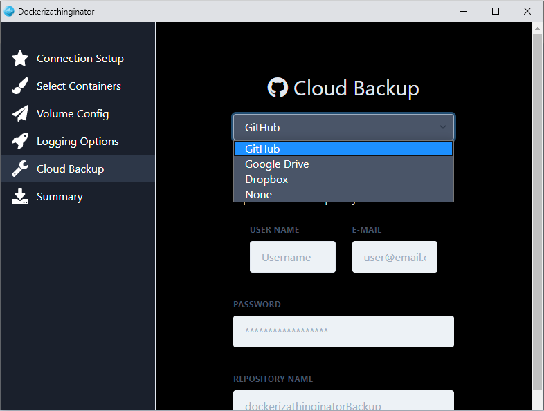

Finally we are on the Summary Pane. This gives us information about all of the settings we selected and allows us to review before going out and applying things. Currently the only functions it accomplishes are the following: updates your device, installs log2ram, git, and other requirements, and deploys Portainer to the volume specified in volume configuration.

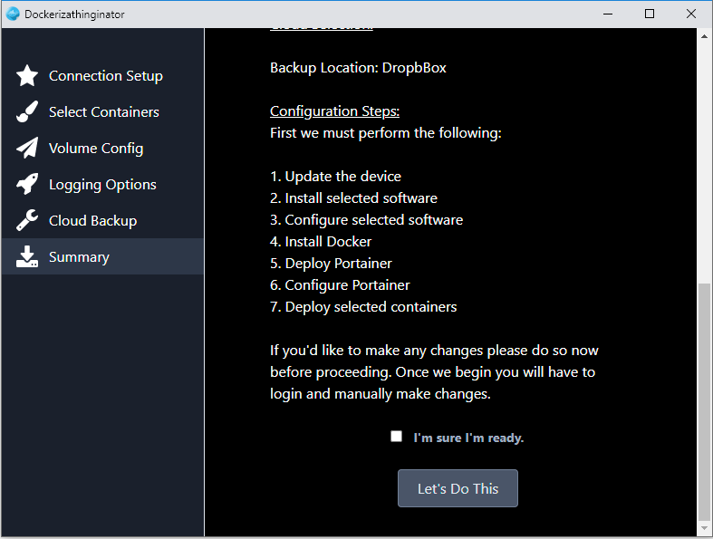

If everything looks how we'd like it. Click the verify box and then the Let's Do This button. This process will take quite some time. You can go grab a coffee or something and come back shortly. Once completed your pi will reboot and upon restart you can browse to your Pi's hostname/ip on port 9000 and setup Portainer. You are now able to manage docker images from your pi without needing to use the command line. I hope this is helpful to some.

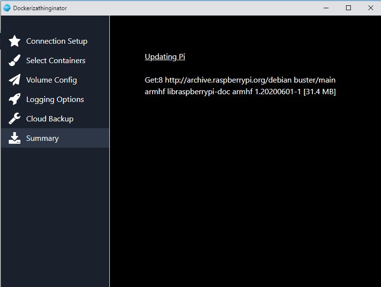


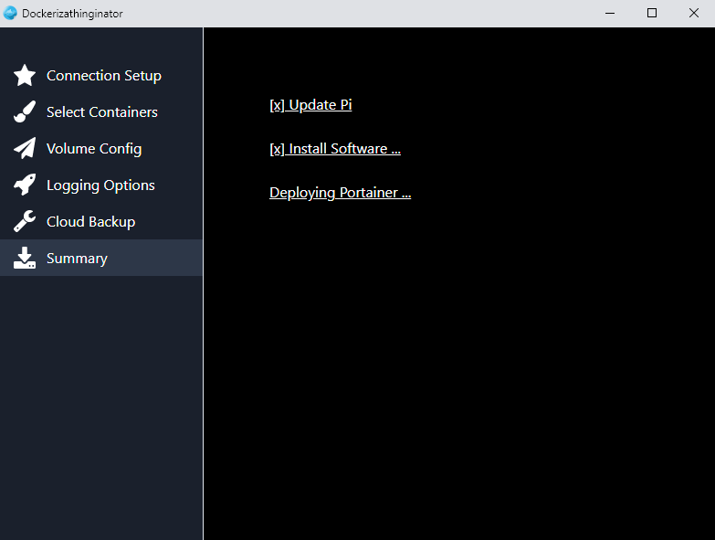

I hope you find this useful. If so, let me know. If there are things you'd like to see added please let me know also!!

Remember this is in active development. Features change as updates are made. What works now may not and what doesn't work now may in the future.

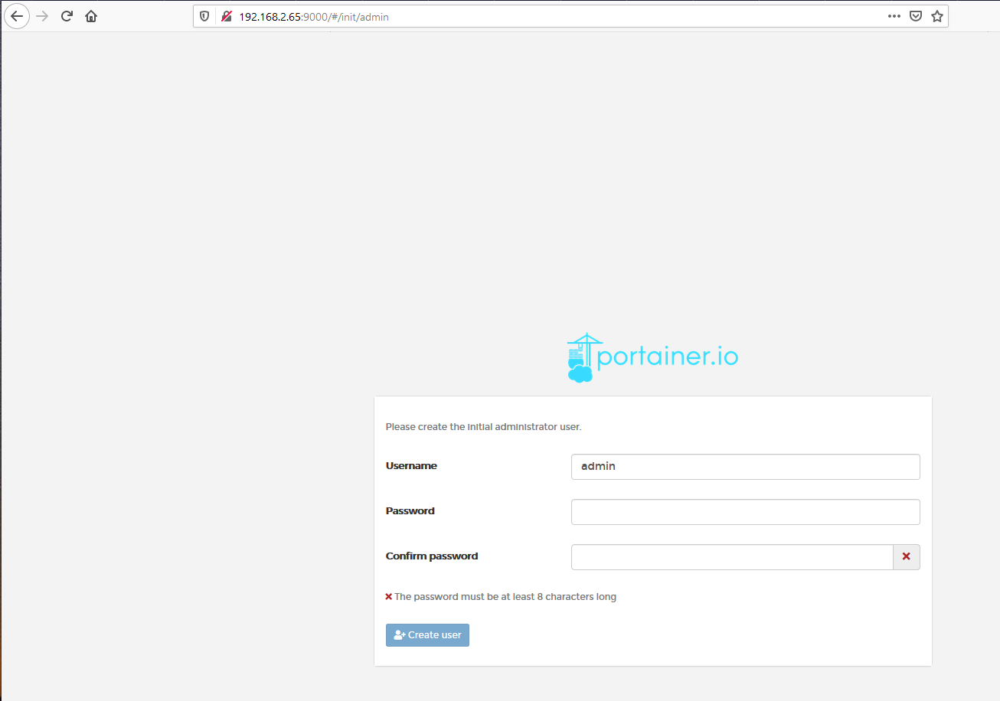