Decentralized web hosting with Fleek is easy and I'm going to walk you through how to use it.

----

### What is Fleek?

Fleek is a tool that links together many open web protocols to give you, the user, one simple interface. Fleek makes it easy to build on Open Web protocols and a base layer infrastructure powered by them. Build and host your sites, apps, Dapps, and other services on trustless, permissionless, and open technologies focused on creating user-controlled, encrypted, private, p2p experiences easily. Build on the New Internet, and take the road to Web 3.0.

Packaging Open Web protocols like the Internet Computer, IPFS, Filecoin, Ethereum, GunDB, ENS, and more, in an ever-shifting stack of technologies that provide technical guarantees, no promises or trust isssues.

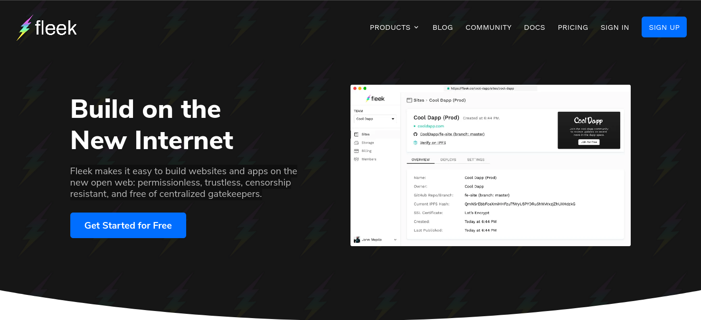

----
### Why use it over Google, Amazon, or traditional hosting?

This is the question. Well, it is decentralized. The data is not owned by any one individual and can therefore not be shut down or misused. What I mean by that is, the data is stored on shared nodes all over the world and not owned by any individual node. Compare this to Google hosting for example. Google can distribute the data as it sees fit, force the user of the service to abide by specific rules, collect information on use of data, etc. Each company that provides hosting has their own rules and ways they use the data that you give them.

Is decentralized better? Objectively, I can say yes. Why? well, it is because decentralized applications, hosting, etc. generally contain four characteristics: the ability to incentivize themselves, contain an open source, abide by an algorithm/protocol that ensures proof of value based on community consensus, and decentralization. 

Why do you care about any of those things? Ok, let's use a centralized hosting provider as an example again. What happens if something happens in their data center, like a giant fire, and everything goes offline. Your application/webiste is down and will be that way until hardware is repaired/replaced and data resupplied. Decentralized applications are shared on all nodes throughout the world. These nodes can even be setup on your own personal computer. Also, censorship, Google can change terms of service and suddenly decide your infosec content is not something they wish to be associated with. They can then disable your application. Decentralized options, this is not possible. Data integrity is another key. Centralized options keep all the data in one or a few places. This means an attacker could, with more ease, manipulate this data. A good example is a hosting service's database. With decentralized services this is exponentially more difficult. Any changes to data would need to be verified by underlying protocols and if all nodes don't agree on the change it is then ignored. Finally, privacy. Amazon, Google, and Facebook 'own' the data that is put on their platforms. That means it can be monitored, mined, whatever else for personal information, trends, etc to be sold to advertisers, third parties, whatever. This is just not available in a decentralized environment.

----
###  Let's start using Fleek!

I know that was a bit long winded but if you're still with me, we are going to get started setting up our fleek hosting! First, we need to setup our account. Go to <https://fleek.co>

Here we click Sign Up and complete the form. It's really quick and easy.

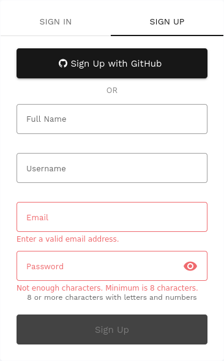

From here you will be greeted with a page that has sections for downloading the sdk, setting up team members, billing, storage, and hosting. We are going to click Add new site.

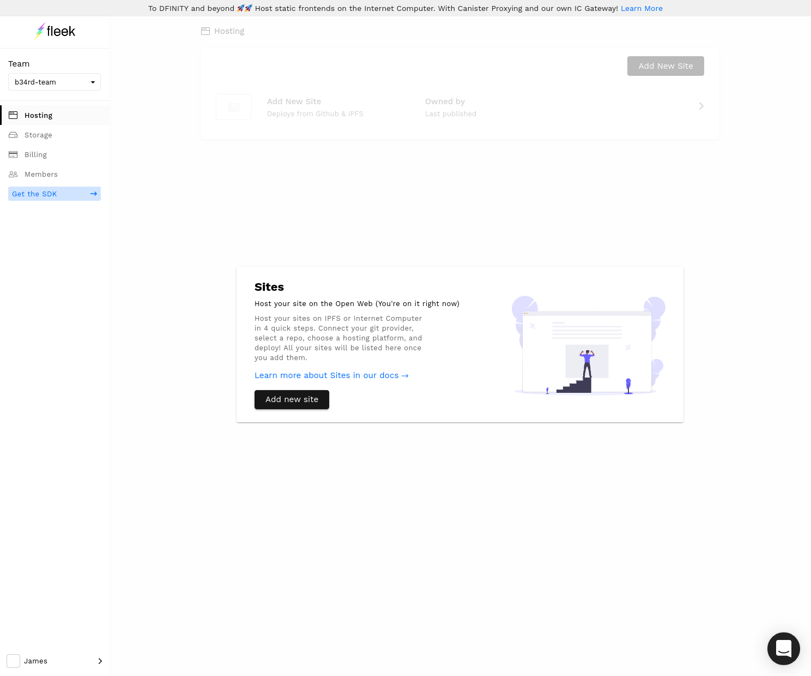

Here wer are greeted with a Continuous Deployment page. If you don't want to use continuous deployment you will need to do everything via the Fleek SDK. I'm not going into that in this post but likely will be at another time (it has all the database stuff for full dapps). I'm going to connect to my github. I have a gridsome repo there titled blog that is perfect for this example.

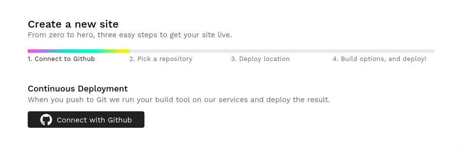

Click the Connect with Github button and select your repo.

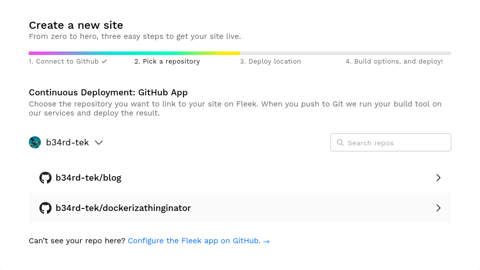

We have another option where we must select our hosting platform. The default is IPFS but you can also select Internet Computer. My preference is IPFS but either one works just fine. Once you have made your selection click continue.

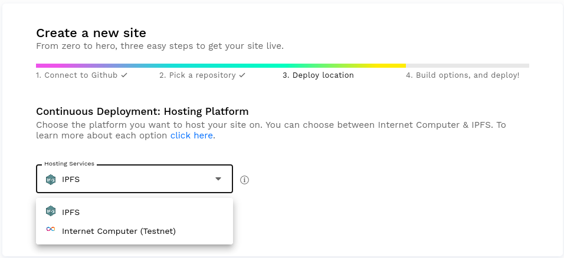

This is where we get to see the real benefit of Fleek. It will read through the repo, show a list of branches to choose from, try to autodetect the framework, and fill out the build options. If it hasn't done anything to your satisfaction you can just modify the options. For me, it was unable to detect gridsome so I had to select it in the Framework box. Here you will see just how flexible this is. You can choose NextJS, React, Hugo, Gatsby, Wordpress, NuxtJS, Jekyll, Gridsome, Svelte, MkDocs, Svelte+Sapper, and Wasm Pack. They are actively working on adding more also. Anyway, once you have selected yours, verify the pre-filled out build options. If all looks good, click Deploy site.

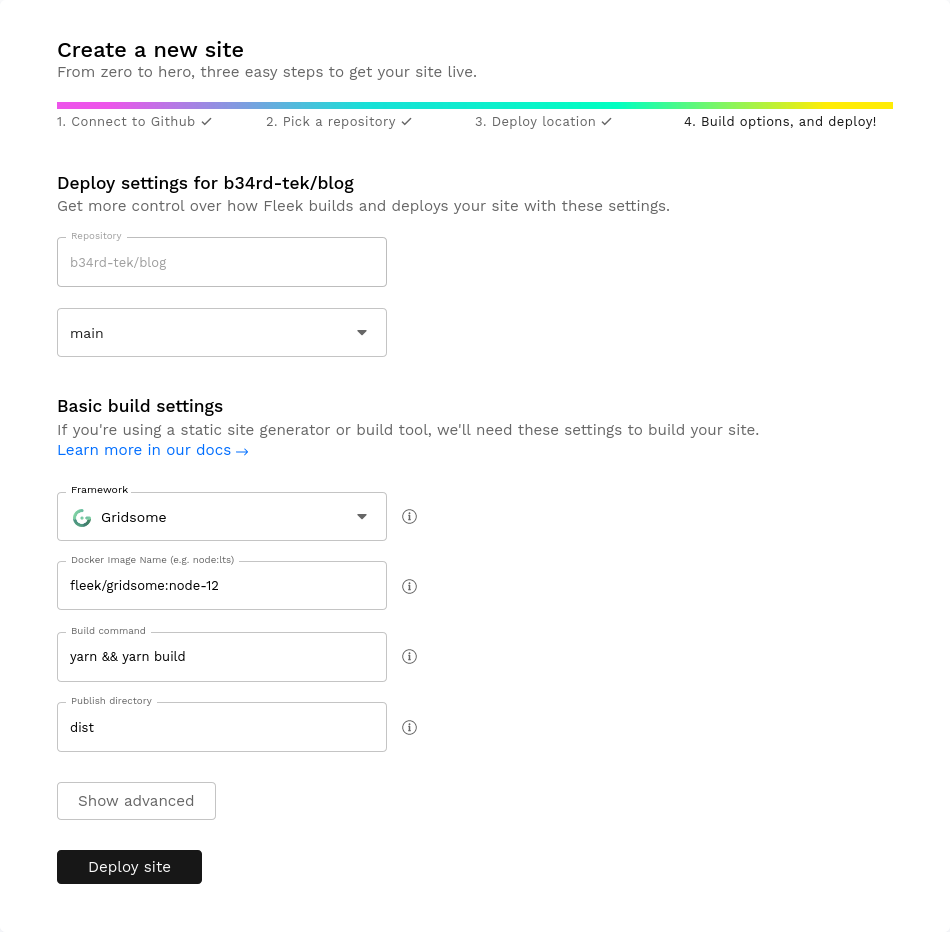

This part can take a bit of time as Fleek grabs your repo, puts it over to your hosting provider, and builds. Be patient, go grab a coffee or a different drink of choice.

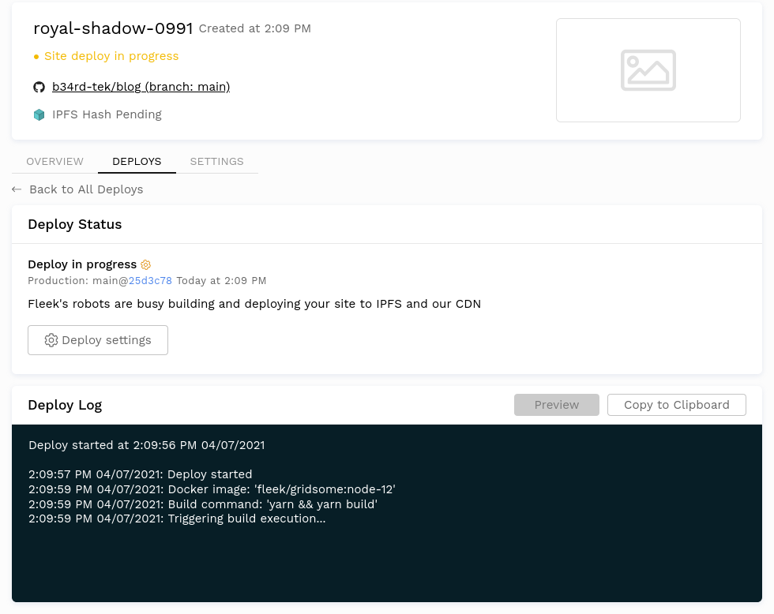

I'm going to update all of my DNS and ENS information so my site can be viewed from b34rd.tech and b34rd.eth.link. If you've made it this far, the rest is just as simple as using any other web hosting provider. In the settings tab you will go down to the domain management area.

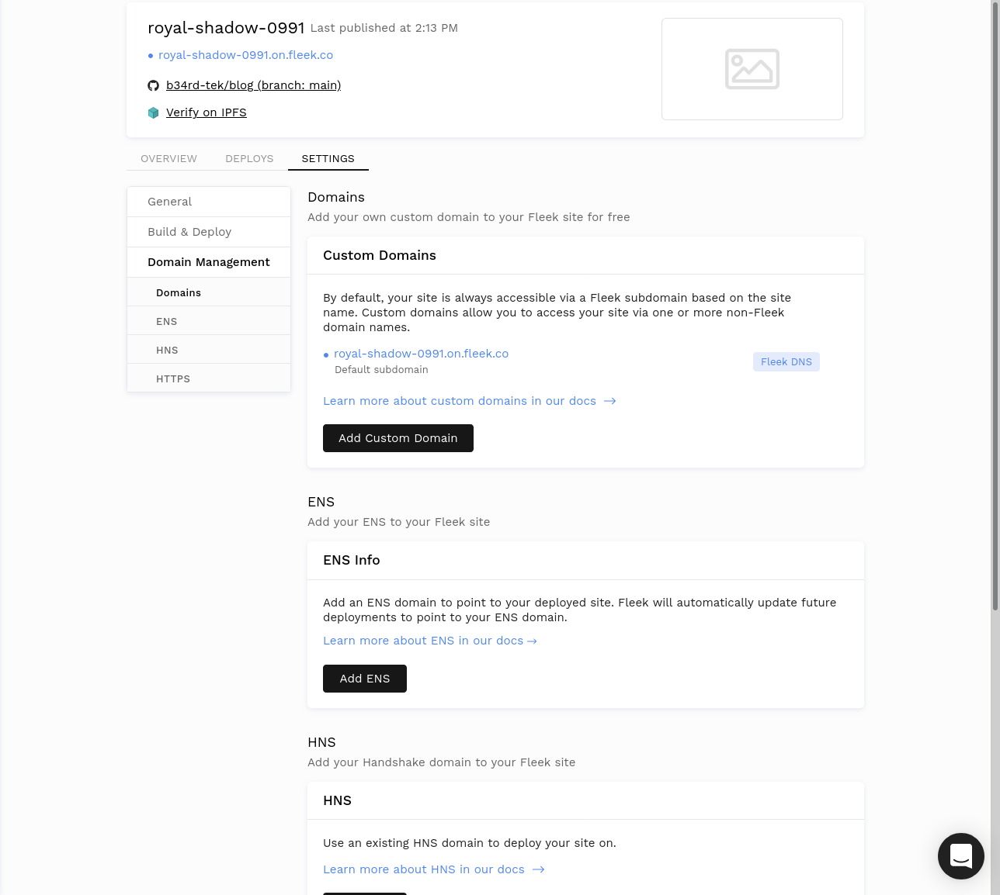

For my DNS info I click Add Custom Domain, fill out the pertinent information, and follow on-screen instructions. Once you have your FQDN added. You will need to do a few things to verify the DNS configuration. The instructions are very straight forward.

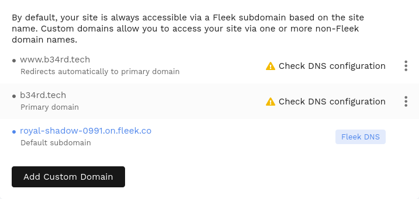

Now that my DNS is all verified and good, I am going to take care of my ENS. It's a very similar process. Click Add ENS and follow the on-screen instructions.

Once finished, you can check out your decentralized website! Fleek has a TON more options to get into with the SDK which we will go over soon. Just getting our feet wet right now. 

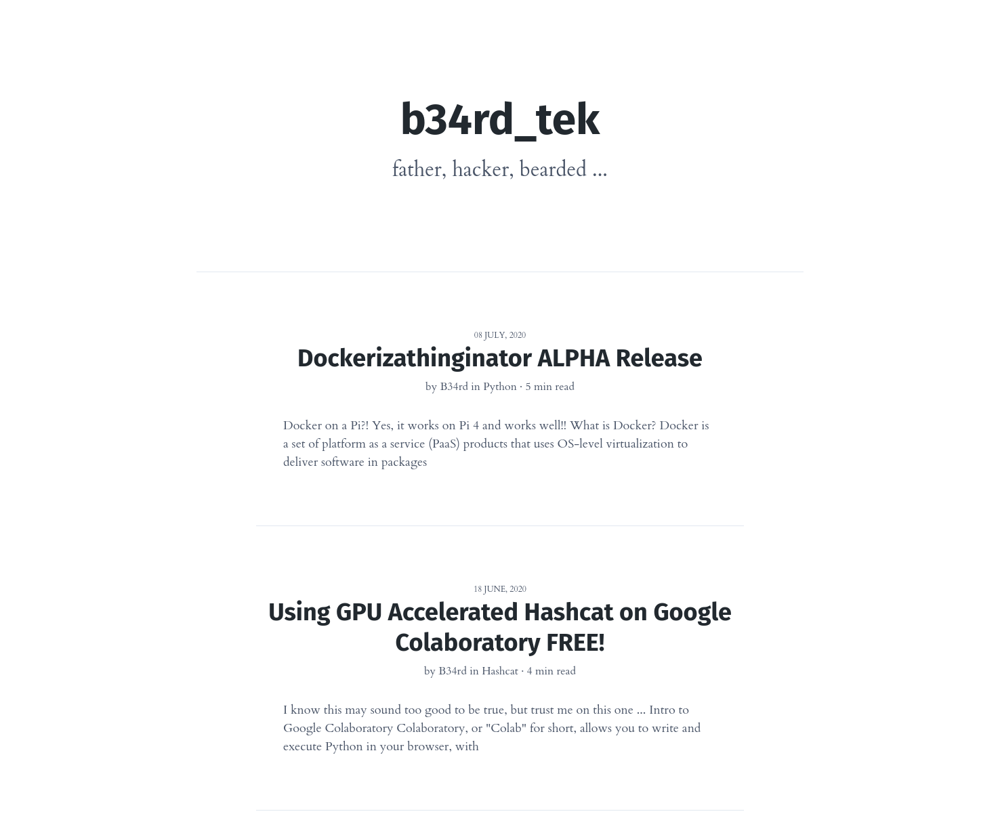

----
###  Conclusion Time.

So, we are all done. The process is actually relatively simple isn't it? Alright, now that we have our blog decentralized, what is next? What do you want to see done? Have any project ideas?