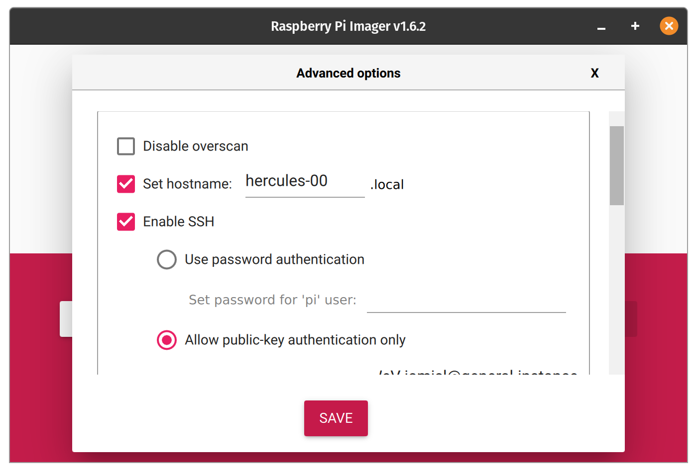
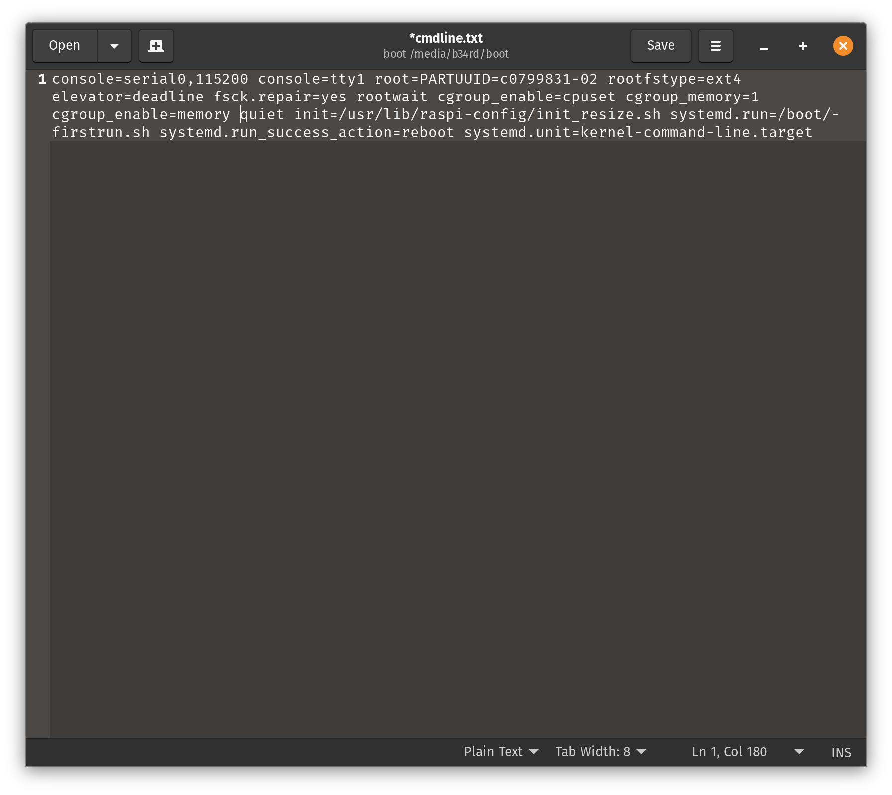
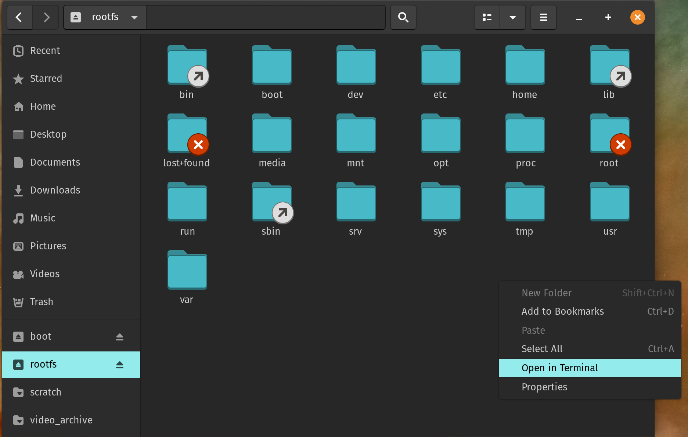
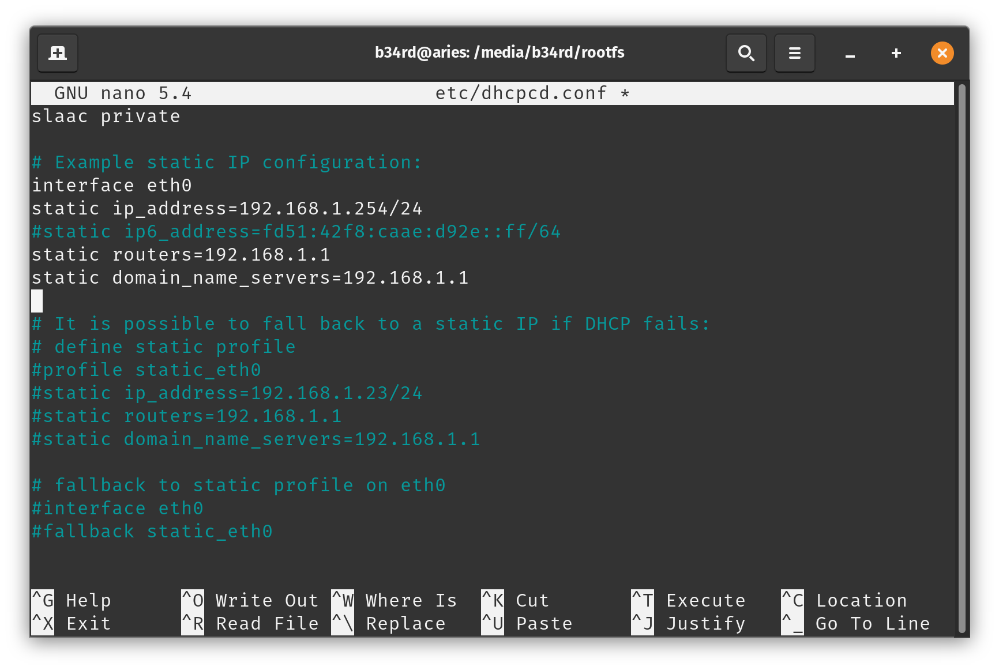
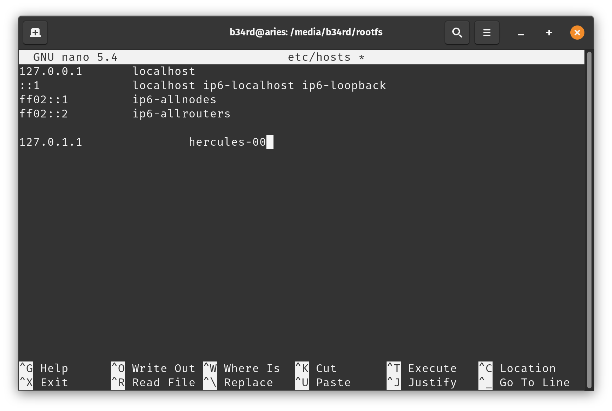
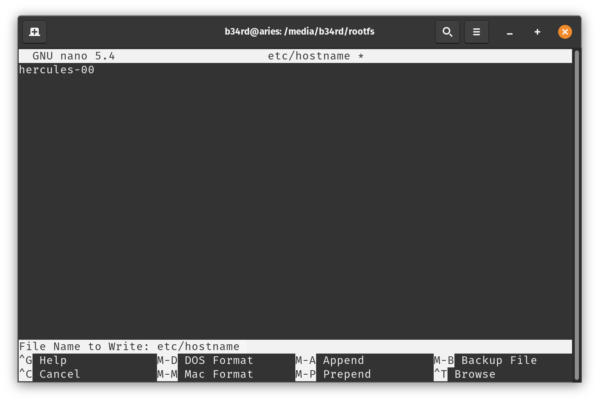
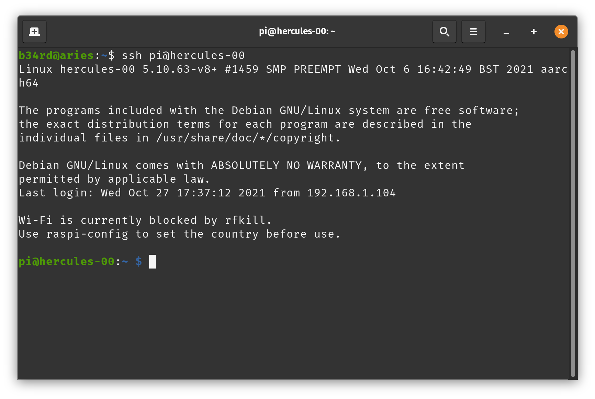
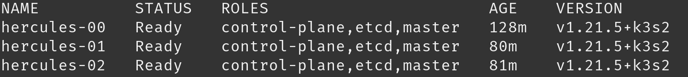
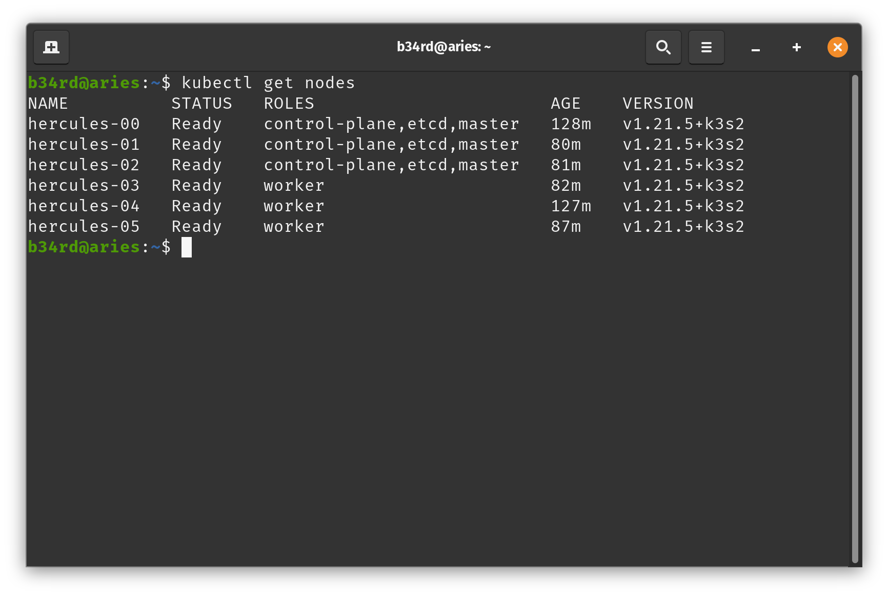
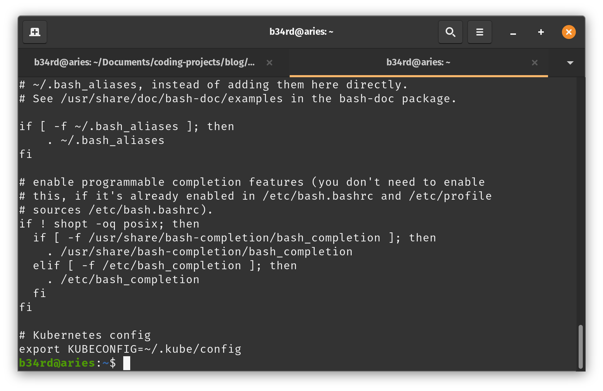

Let's setup K3S HA Kubernetes on Raspberry Pi Cluster for your Homelab! It sounds intense but really, it's pretty awesome!


### What is k3s and why use it?

There are a few diferent versions of Kubernetes that we can choose from. There's k8s, minik8s, k3s, etc. Why k3s? 

K3s is a highly available, certified Kubernetes distribution designed for production workloads in unattended, resource-constrained, remote locations or inside IoT appliances. K3s is packaged as a single <50MB binary that reduces the dependencies and steps needed to install, run and auto-update a production Kubernetes cluster. Both ARM64 and ARMv7 are supported with binaries and multiarch images available for both. K3s works great from something as small as a Raspberry Pi to an AWS a1.4xlarge 32GiB server.


### Why k3s over docker, docker-swarm, virtualization, or just bare metal?

Well, these are all great questions and honestly each application, server, and use needs to be considered to answer that question fully. For a homelab, home network, or even a small business k3s on a raspberry pi cluster can more than adequately serve your internal and even some of your external needs without any trouble. If  you are like me and are constantly tinkering or improvoing k3s will be a HUGE help as the redundancy after a breaking configuration change will save you time and complaining kids/co-workers. In the examples I'm giving during these guides, kubernetes and k3s are perfect for the use cases and workloads. 

The key differences between all of these is how you want to implement and provide services. I like load balancing, automations, redundancies, and a comprehensive management plane. That's why k3s is my choice. Also, docker is super awesome so why not take it to the extreme?


### Lets get our Pis ready!

Ready to begin, awesome! Here's the items we need to get together:

  + 3 or more Raspberry Pi 4s
  + Network access for these devices
  + SD Cards or USB SSD (highly recommend this option)
  + A workstation to image from and manage your cluster from


I'm using 6 Raspberry Pi 4s. I have an UCTRONICS rack for 4 that will be wall mounted and two in metal cases that will also be wall mounted. They are all powered via POE hats from UCTRONICS also.

Now that we've gathered up all of our hardware let's think for a moment how we are going to set this up. Firstly, we need at minimum 3 Raspberry Pi 4s because we are building an HA cluster on the embedded etcd datastore. You can use less if you want to spin up another server for mariaDB, PostgreSQL, or another datastore option. I'm trying to keep everything on the cluster and what isn't we can easily share between workstations. For the etcd embedded datastore Rancher recommends an odd number of master nodes in the cluster. I've tested this with two and it just doesn't function correctly so please, use 3, 5, 7, 9 or whatever odd number of them you'd prefer. You can actually just start with one and add another master later if you only have two Raspberry Pis. Now, how are we connecting them? You can use wifi or ethernet if you want. The important thing is to ensure you have static IP addresses assigned and ssh enabled. We also need to use a 64 bit OS. You can use Ubuntu Server or Raspbian 64. There are slight configuration differences between the two and for this guide I will be using Raspbian 64bit. So, let's go grab that...

<https://downloads.raspberrypi.org/raspios_arm64/images/raspios_arm64-2020-05-28/>

This is the latest image as of writing. You can check in the images folder to see if there is a newer version also if you choose. This version is the Lite version of the 64 bit OS. Once downloaded extract the zip and then we will go into Raspberry Pi Imager. This is super easy because we can image our SD cards or USB drives with ssh enabled, our public keys, and wifi. We will still need to mount the drive after imaging to setup static IP address, hostname, and some cmdline options.


Under Operating System we will select Custom OS and then select the image we downloaded. Then select your SD Card or your USB drive. Before clicking write press [CTRL] + [Shift] + [X]. This will display the advanced menu. Here we can enable ssh, select our public key, enable wifi (if using it), set TZ, and make a few other changes. We can also check the box to make this the default for all images going forward. Once you are happy with everything click save, then click write.



You will need to repeat this process for every Pi you are setting up. Once finished, we will need to mount the boot and root partitions of our flashed drive. In the boot portion we need to add some lines to cmdline.txt file. 

After the text 'rootwait' and before 'quiet' add the following:

```shellscript
cgroup_enable=cpuset cgroup_memory=1 cgroup_enable=memory
```

It will look something like this



You will have some additional text after rootwait but ensure you put this between rootwait and quiet. From quiet on is removed after the first boot because they are used for resizing your volume
Next we need to edit dhcpcd.conf. This can be done by opening a terminal browsing to the mounted folder of our rootfs partition. You can do this easily by using the file browser.



```shellscript
sudo nano etc/dhcpcd.conf
```

Here you need to setup your static IP address information. You can scroll down, uncomment lines, and edit them as needed. Mine looks like this:



Next we need to edit the following two files: /etc/hosts and /etc/hostname. We will need to change raspberrypi in each of them with the name we specified. They are edited by executing

```shellscript
sudo nano etc/hosts
```

then we need to edit

```shellscript
sudo nano etc/hostname
```

 



For my master I went with hercules-00, hercules-01, and hercules-02. The nodes followed the same naming scheme up to hercules-05.

Once all these changes are made on ALL of our drives we can insert them into our Raspberry Pis and boot them up! Once they are all up and running we will need to ssh into them all and do a few more things. Here we have some choices. We can either do this manually or use a tool like ansible. We are going to go through it all manually so we can understand the steps in case we need to troubleshoot.

Ok, let's ssh into our first Pi.



From here we have to do a little bit of setup. First, let's do our usual housekeeping stuff and configure locales with raspi-config and of course fully update our system. Once this is done, we need to setup iptables. Raspbian is using nftables instead of iptables and k3s doesn't work with this. We need to execute the following on every one of our pis

```shellscript
sudo iptables -F
sudo update-alternatives --set iptables /usr/sbin/iptables-legacy
sudo update-alternatives --set ip6tables /usr/sbin/ip6tables-legacy
sudo reboot
```

### Finally installing k3s

The part we have been building up to... installing our cluster! I promise, the hardest part of this is over. This part is just copy, paste, and go!

Ok, let's ssh into our first pi, the first master we are setting up and we need to execute the following:

```shellscript
sudo curl -sfL https://get.k3s.io | sh -s - --write-kubeconfig-mode 644 --cluster-init
```

We just need to wait for this to finish and when it does we can move on to the next Pi.
My next Pi is my second of the three masters that I am setting up in my cluster. Luckily the command I run on this will be the same as what I run on the third. We need to grab our server token from the Pi we just setup. To do this we just execute the following:

```shellscript
sudo cat /var/lib/rancher/k3s/server/token
```

Now we just copy that string and paste it into our command for our remaining masters here:

```shellscript
sudo curl -sfL https://get.k3s.io | K3S_TOKEN=<TOKEN STRING> sh -s - --write-kubeconfig-mode 644 --server https://<IP OF FIRST MASTER>:6443
```

We can go ahead and run this command on the next master also.

Now that the master nodes are ready we can check them by running

```shellscript
kubectl get nodes
```

We should see all three of our masters listed like this:



So, on our first master we need to grab our node-token. We do this by catting the node-token file

```shellscript
sudo cat /var/lib/rancher/k3s/server/node-token
```

We just copy this string and then ssh into our nodes and run the following:

```shellscript
sudo curl -sfL https://get.k3s.io | K3S_TOKEN=<NODE TOKEN STRING> K3S_URL=https://<IP OF FIRST MASTER>:6443 sh -
```

We can then go back to one of our master nodes and watch these come online!

```shellscript
watch kubectl get nodes
```

Once all show up as ready you are good to go!

There is one last thing before we move on to setting up our workstation. This is optional but I hate seeing the worker nodes not say they are workers. We can fix that.

```shellscript
kubectl label node <node-hostname> node-role.kubernetes.io/worker=worker
```
Once you do this for your nodes you will have something that looks like this



### Setting up our workstation
Yes! We have a working k3s cluster on Raspberry Pis! Let's setup our workstation so we don't have to ssh into anything. First things first, we need to install kubectl on our system. So, if you are using Windows you will need to verify whether or not you need to enable WSL. On Linux it's a one liner...

```shellscript
curl -LO "https://dl.k8s.io/release/$(curl -L -s https://dl.k8s.io/release/stable.txt)/bin/linux/amd64/kubectl"
```

Awesome! Now we need to copy over our config from our first master. You may be wondering, why do we keep using the first master? Well, that's because etcd takes some time to replicate so we are going with the source to ensure we have the correct, up-to-date info.

```shellscript
scp pi@<FIRST MASTER IP>:/etc/rancher/k3s/k3s.yaml .
```

You can decide where and how you want to store this file, I create a folder in my home directory called .kube and put the k3s.yaml file in it. Then I export it and add it to my .bashrc to ensure it happens automatically.



If we open this file, we will see that it points to 127.0.0.1:6443. If we run kubectl we get nothing! We want to ensure our HA master nodes area able to handle requests. How are we going to do that? If one goes down and we only have this file pointed to one we are going to be in trouble. We need a load balancer. We can solve this a number of ways, my favorite way is with a config file and nginx in docker. Here is what my config file looks like:

```shellscript
events {}

stream {
  upstream k3s_servers {
    server 192.168.1.248:6443;
    server 192.168.1.249:6443;
    server 192.168.1.250:6443;
  }

  server {
    listen 6443;
    proxy_pass k3s_servers;
  }
}
```

I created a folder called .nginx in my home folder and stored the file nginx.conf there with the info listed above. To deploy our load balancer we just run

```shellscript
sudo docker run -d --restart=unless-stopped -p 6443:6443 -v /home/b34rd/.nginx/nginx.conf:/etc/nginx/nginx.conf nginx:1.14
```

Now let's run kubectl get nodes and see what happens!


If you have that, you are good to go! Now one final thing before we close out this part. We are going to configure helm! What is helm? It's a package manager for Kubernetes. <https://helm.sh/>. We are just going to follow the installation instructions found at <https://helm.sh/docs/intro/install/>. I went with the script method and had to run the installer with sudo.

```shellscript
curl -fsSL -o get_helm.sh https://raw.githubusercontent.com/helm/helm/main/scripts/get-helm-3 &&
chmod +x get_helm.sh &&
sudo ./get_helm.sh
```

Once the installation is finished, we are going to add some chart repositories and ensure everything is good.

```shellscript
helm repo add stable https://charts.helm.sh/stable &&
helm repo add bitnami https://charts.bitnami.com/bitnami &&
helm repo update
```

Once that's finished we are ready to move on to part 2!

### Conclusion

Well, you now have a k3s HA cluster setup. Well, that's if you used more than 1 Pi. If  you used one and just follwed instructions for the first master you are ready to add more master nodes and some worker nodes. In the next part we will setup the Kubernetes Dashboard, Metallb, Cert-Manager, Rancher, and Longhorn. Once we have those up and running we can configure replicated and persistent storage, backups, and a few other fun tweaks. In Part 3 we will begin adding all of our homelab things like PiHole, UniFi Network Application, Heimdall, Squid, and tons more. They all thrive in this environment as if one worker or even one master that is hosting a pod (the thing that holds containers in kubernetes) goes down, another will pickup the task and keep your apps going! If you have any questions feel free to ask. Also, I've listed my references and resources below. Happy hacking!

References:
 + <https://rancher.com/>
 + <https://rancher.com/docs/k3s/latest>
 + <https://k3s.io/>
 + <https://www.raspberrypi.com/>

Resources:
 + <a target="_blank" href="https://www.amazon.com/gp/product/B089DGSLZW/ref=as_li_tl?ie=UTF8&camp=1789&creative=9325&creativeASIN=B089DGSLZW&linkCode=as2&tag=b34rd-20&linkId=4630dc5c191b7534758d639ec9822eba">Raspberry Pi 4 Model B 8GB</a>
 + <a target="_blank" href="https://www.amazon.com/gp/product/B07TC2BK1X/ref=as_li_tl?ie=UTF8&camp=1789&creative=9325&creativeASIN=B07TC2BK1X&linkCode=as2&tag=b34rd-20&linkId=5a84a68eb88ed682e9fb9ecb02fe6f52">Raspberry Pi 4 Model B 4GB</a>
 + <a target="_blank" href="https://www.amazon.com/gp/product/B07D7P4SY4/ref=as_li_tl?ie=UTF8&camp=1789&creative=9325&creativeASIN=B07D7P4SY4&linkCode=as2&tag=b34rd-20&linkId=6c7cd60c5b5aa9f2ae3d0d609508b7ea">SAMSUNG 64GB - USB 3.1 Flash Drive</a>
 + <a target="_blank" href="https://www.amazon.com/gp/product/B082ZLDMZ6/ref=as_li_tl?ie=UTF8&camp=1789&creative=9325&creativeASIN=B082ZLDMZ6&linkCode=as2&tag=b34rd-20&linkId=e97859199ae66ec5bb0e138965b681a0">UCTRONICS PoE HAT for Raspberry Pi 4</a>
 + <a target="_blank" href="https://www.amazon.com/gp/product/B096MKY263/ref=as_li_tl?ie=UTF8&camp=1789&creative=9325&creativeASIN=B096MKY263&linkCode=as2&tag=b34rd-20&linkId=c542aa40713691b903bff24d47643d9a">UCTRONICS Raspberry Pi Cluster Metal Rack for 4 with silent(well, quiet) fans</a>
 + <a target="_blank" href="https://www.amazon.com/gp/product/B098B6YXBQ/ref=as_li_tl?ie=UTF8&camp=1789&creative=9325&creativeASIN=B098B6YXBQ&linkCode=as2&tag=b34rd-20&linkId=a13958c9c606992306923985b6eea252">UCTRONICS 1U Rack with PoE Functionality for Raspberry Pi 4 Supports 1-6 Units with PoE HAT, Power Switch, and SD Card Adapter</a>
 + <a target="_blank" href="https://www.amazon.com/gp/product/B09152NSB9/ref=as_li_tl?ie=UTF8&camp=1789&creative=9325&creativeASIN=B09152NSB9&linkCode=as2&tag=b34rd-20&linkId=87faf7962096ccd54de8c9b8a9f4b7b4">UCTRONICS 2U Rackmount for Raspberry Pi 4, 12 Mounting Plates for Pi 4 Model B</a>
 + <a target="_blank" href="https://www.amazon.com/gp/product/B00NEMGCIA/ref=as_li_tl?ie=UTF8&camp=1789&creative=9325&creativeASIN=B00NEMGCIA&linkCode=as2&tag=b34rd-20&linkId=3065851130ceec401727ce00e1eb20f8">Noctua NF-A4x10 Fan 5V, 3-Pin, 5V Version (40x10mm, Brown)</a>
 + <a target="_blank" href="https://www.amazon.com/gp/product/B06XWN9Q99/ref=as_li_tl?ie=UTF8&camp=1789&creative=9325&creativeASIN=B06XWN9Q99&linkCode=as2&tag=b34rd-20&linkId=ebac93c449ef34ea471e3a9ba8c62e46">SAMSUNG 32GB 95MB/s (U1) microSDHC</a>
 + <a target="_blank" href="https://www.amazon.com/gp/product/B07VYRZ23K/ref=as_li_tl?ie=UTF8&camp=1789&creative=9325&creativeASIN=B07VYRZ23K&linkCode=as2&tag=b34rd-20&linkId=035d841aeddf241541230983633c800b">Raspberry Pi 4 Model B Aluminum Case Metal Chassis Shell Box with Onboard Cooling Fan (Black) (for Raspberry Pi 4)</a>
