We have made it to a part 3!! Today we are going to get a bunch of things up and running on our cluster. The part we have all been waiting for! We are going to get pihole, and unifi network application on our cluster. There are multiple ways to setup all of these applications. We will use Rancher but I will also explain some commandline ways to do some of the parts too. Let's jump in!

### PiHole
Let's begin with everyone's favorite Raspberry Pi tool, PiHole. We all know what this is and we all love it. We are going to be setting ours up with cloudfared for DOH and DOT DNS traffic also. Log into Rancher and create a new project called Networking. Well, you can name it whatever you'd like but mine is going to be networking. Then I am going to create a namespace called pihole.

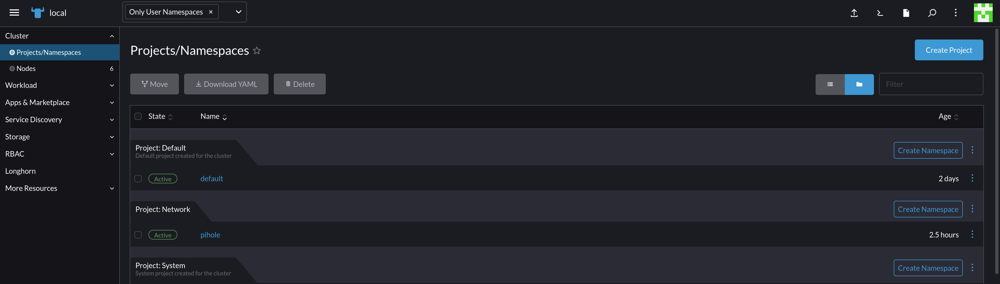

Now that we have project and namespace we need to add some repos into Helm on Rancher. Click on Apps & Marketplace then Repositories. Now we click create. Here we add in our pihole repo. I'm going with one that was made specifically for k3s.

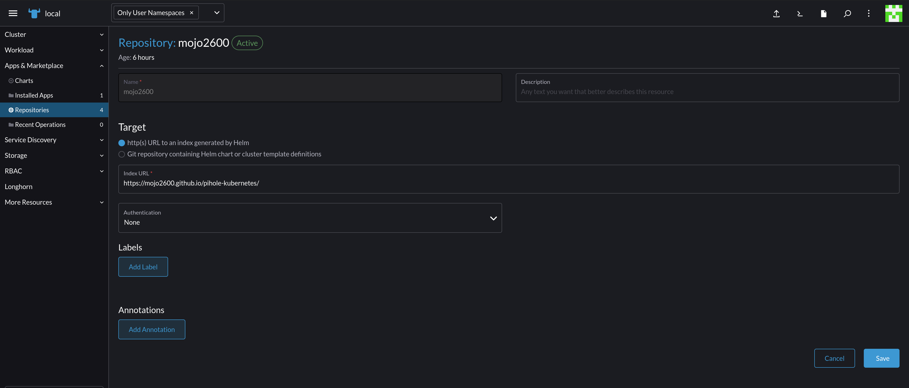

Before we install we need to setup a couple of things. First, we need to make sure we are in the pihole namespace in Rancher. We do this by selecting it in the top.

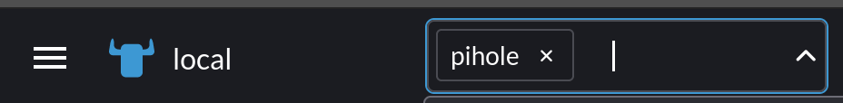

Now we need to create two things, our secrets file for our admin password and our persistent volume. The both are created in the Storage section. We create a secret just like we did for S3, this time though we just need one key value pair of password and the password value. If you don't remember exactly how to do that, it's Opaque secret, name it whatever you'd like, and input the key of password and the value of what you want your password to be. Then save.

Next, we need to create our persistent volume. In the Storage section we just need to select PersistentVolumeClaims then click Create. Here we have a few options, the name of our claim, the storage class, and the size. I'm naming mine pihole, the class is longhorn, and the size is 500Mi. 

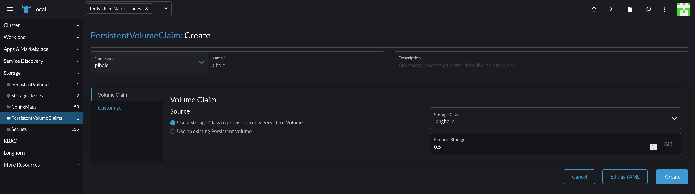

We can actually go check this volume out in Longhorn too. We can see what nodes it has been replicated to and all the details.

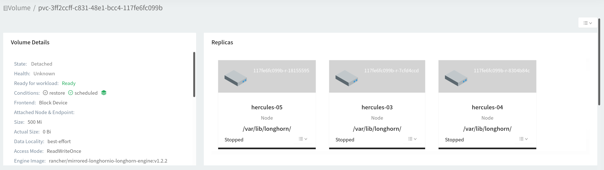

With those two things setup we can now go back to our pihole namespace and click Apps & Marketplace, click on charts and scroll down until we see PiHole. Select it and click install. Here we are prompted for a namespace and if it doesn't say pihole we can change it one last time.

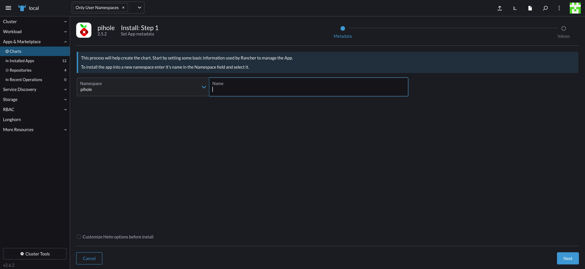

Once we click next we are given a yaml file of values that we need to configure based on our needs. This is a large file so I'm going to just tell you the parts we need to change. From the top to the bottom here are my changes:

- DNS1: 192.168.1.1
- DNS2: 1.1.1.1
- existingSecret: 'pihole' (this is the secret we setup earlier)
- doh enabled to true
- ingress enabled to true
- ingress hosts changed from -chart-example.local to pi.hole (you can use whatever you'd like)
- add under the line PersistentVolumeClaim add existingClaim: "pihole" (make sure to use two spaces before for yaml syntax and the name of your volume you created)
- set nameservers again where they are listed
- under service DNS I specify LoadBalancerIP: '' to one of the IP address in MetalLB pool (192.168.1.201 for me)
- change NodePort to LoadBalancer

That's everything I have modified. Once your configuration is how you'd like it, click install. To note, if you want to use DOH, you must use ClusterIP for the web services. If you don't, you will run into issues with Rancher ports. Also, if you cannot use HostPort with DNS for DOH to work.

We can view progress of deployment here and shortly it will be up. Once things are up, we can check on our ingresses. We will need to create another entry in our DNS or our local hosts file.

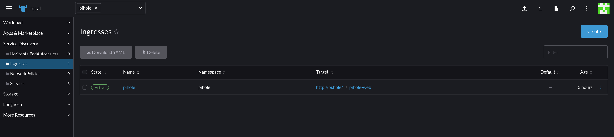

We can view more information if we click through here. Our traefik IP is the same as it was for our Rancher deployment so we need to point our DNS entry to it. In my case it is 192.168.1.200. Once setup we can browse to our pihole instance and login with the password specified in our secrets.

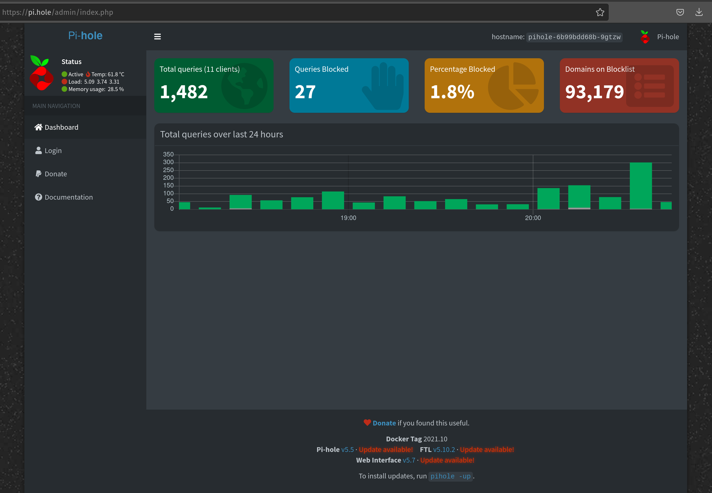

----

#### Install from CLI

On our workstation let's add the helm repo...

```shellscript
helm repo add mojo2600 https://mojo2600.github.io/pihole-kubernetes/
helm repo update
```

Now let's grab the values file that has all of our options.

```shellscript
helm show values mojo2600/pihole >> pihole.values.yml
```

This is a rather large file so I'm going to share with you the parts that I changed. I recommend you look through and find out what options you want for your configuration. First, we need to create persistent volumes and persistent volume claims. We can do this in the Longhorn dashboard or from our workstation. I'm going to do it from my workstation because, well, I have to do everything else from here. Let's create a file called pihole.longhornpvc.yml

```yaml
---
apiVersion: v1
kind: PersistentVolumeClaim
metadata:
  namespace: "pihole"
  name: "pihole"
spec:
  storageClassName: "manual"
  accessModes:
    - ReadWriteOnce
  resources:
    requests:
      storage: "500Mi"
---
```

We can then apply this PVC using kubectl

```shellscript
kubectl apply -f pihole.longhornpvc.yml
```

We can now look at our pvc via kubectl and in Longhorn

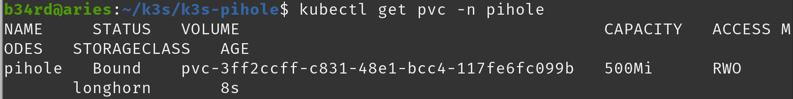

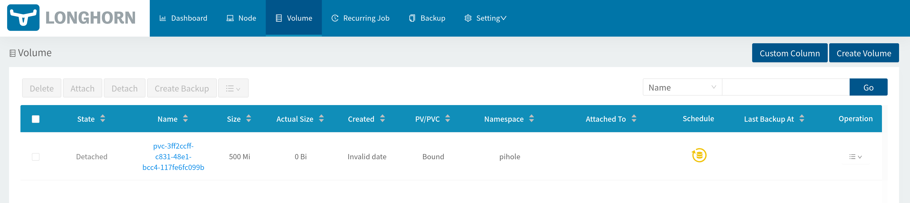

If we click on the volume in Longhorn we can see it's replication status and details.


Perfect! They are both there! We can now work on our pihole values. I'm going to break this up and show the parts I have changed. You will want to verify all the information for yours.

```yaml
dualStack:
  # -- set this to true to enable creation of DualStack services or creation of separate IPv6 services if `serviceDns.type` is set to `"LoadBalancer"`
  enabled: false

dnsHostPort:
  # -- set this to true to enable dnsHostPort
  enabled: false
  # -- default port for this pod
  port: 53

# -- Configuration for the DNS service on port 53
serviceDns:

  # -- deploys a mixed (TCP + UDP) Service instead of separate ones
  mixedService: false

  # -- `spec.type` for the DNS Service
  type: LoadBalancer

  # -- The port of the DNS service
  port: 53

  # -- `spec.externalTrafficPolicy` for the DHCP Service
  externalTrafficPolicy: Local

  # -- A fixed `spec.loadBalancerIP` for the DNS Service
  loadBalancerIP: "192.168.1.201"
  # -- A fixed `spec.loadBalancerIP` for the IPv6 DNS Service
  loadBalancerIPv6: ""

  # -- Annotations for the DNS service
  annotations:
    metallb.universe.tf/address-pool: default
    metallb.universe.tf/allow-shared-ip: pihole-svc
```

To go over my changes, I set dnsHostPort to true, disabled mixed service, set LoadBalancer to the type, set the IP from the range we configured before (I want to ensure this stays the same no matter what), and annotated the svc and the address pool for metallb. Let's keep going. I don't want DHCP so I'm skipping over that part. For the web service...

```yaml
# -- Configuration for the web interface service
serviceWeb:
  # -- Configuration for the HTTP web interface listener
  http:

    # -- Generate a service for HTTP traffic
    enabled: true

    # -- The port of the web HTTP service
    port: 80

  # -- Configuration for the HTTPS web interface listener
  https:
    # -- Generate a service for HTTPS traffic
    enabled: true

    # -- The port of the web HTTPS service
    port: 443

  # -- `spec.type` for the web interface Service
  type: ClusterIP

  # -- `spec.externalTrafficPolicy` for the web interface Service
  externalTrafficPolicy: Local

  # -- A fixed `spec.loadBalancerIP` for the web interface Service
  loadBalancerIP: ""
  # -- A fixed `spec.loadBalancerIP` for the IPv6 web interface Service
  loadBalancerIPv6: ""

  # -- Annotations for the DHCP service
  annotations: {}
    # metallb.universe.tf/address-pool: default
    # metallb.universe.tf/allow-shared-ip: pihole-svc
```

This is pretty self explanatory. I set ingress to false and kept moving until I found the persistent volume claim information...

```yaml
# -- `spec.PersitentVolumeClaim` configuration
persistentVolumeClaim:
  # -- set to true to use pvc
  enabled: true

  # -- specify an existing `PersistentVolumeClaim` to use
  existingClaim: "pihole"

  # -- Annotations for the `PersitentVolumeClaim`
  annotations: {}

  accessModes:
    - ReadWriteOnce

  size: "500Mi"
```

We need to match this up with our volume we created earlier. Now I leave everything the same until we get to the password section and extra vars...

```yaml
# -- Use an existing secret for the admin password.
admin:
  # -- Specify an existing secret to use as admin password
  existingSecret: "pihole-secret"
  # -- Specify the key inside the secret to use
  passwordKey: "password"

# -- extraEnvironmentVars is a list of extra enviroment variables to set for pihole to use
extraEnvVars:
  TZ: "America/Cancun"
```

You can put your password directly into the yaml but I like to use secrets and not have passwords stored in clear text. You can configure yours how you choose but here is how I created my secret:

```shellscript
kubectl create secret generic pihole-secret \
    --from-literal='password=<ADMIN_PASSWORD>' \
    --namespace pihole
```
As we continue through the values, I set DNS based on my local one as well as cloudflare at 1.1.1.1. Next I enabled cloudflared

```yaml
doh:
  # -- set to true to enabled DNS over HTTPs via cloudflared
  enabled: true
  name: "cloudflared"
  repository: "crazymax/cloudflared"
  tag: latest
  pullPolicy: IfNotPresent
  # -- Here you can pass environment variables to the DoH container, for example:
  envVars:
    TUNNEL_DNS_UPSTREAM: "https://1.1.1.2/dns-query,https://1.0.0.2/dns-query"
    TZ: "America/Cancun"
  # -- Probes configuration
  probes:
    # -- Configure the healthcheck for the doh container
    liveness:
      # -- set to true to enable liveness probe
      enabled: true
      # -- defines the initial delay for the liveness probe
      initialDelaySeconds: 60
      # -- defines the failure threshold for the liveness probe
      failureThreshold: 10
      # -- defines the timeout in secondes for the liveness probe
      timeoutSeconds: 5
```

From here we have dnsmasq section where I recommend adding in all of our nodes. You can also do this later via the web interface. It's up to you. Both ways work great! Finally the last section

```yaml
podDnsConfig:
  enabled: true
  policy: "None"
  nameservers:
  - 127.0.0.1
  - 192.168.1.1
```

Once we have all of these configured, save the file and let's double check out secret in Rancher or via kubectl. Then deploy our PiHole instance!

```shellscript
kubectl get secrets -n pihole
kubectl get pvc -n pihole
```

Alright, we look good, let's deploy!

```shellscript
helm install pihole mojo2600/pihole \
  --namespace pihole \
  --values pihole.values.yml
```

We can watch this deployment with

```shellscript
watch kubectl get all -n pihole -o wide
```

Once everything is done we can verify our ingress

```shellscript
kubectl get ingress -n pihole
```

Now we just add our DNS info like we did for Rancher. We are good to go!


### Unifi Network Application

This, I know, doesn't apply to everyone. Personally, I use Ubiquiti switches, access points, gateways, and cameras. That means having either this software installed on my workstation, a server, or in k3s how I'm going to. Previously, I've ran this in docker but if it goes down I'm unable to configure any of my devices or manage my network. Our HA k3s cluster seems perfect! 

First things first, let's prep our environment. In the Network project I'm going to create a new namespace called unifi.

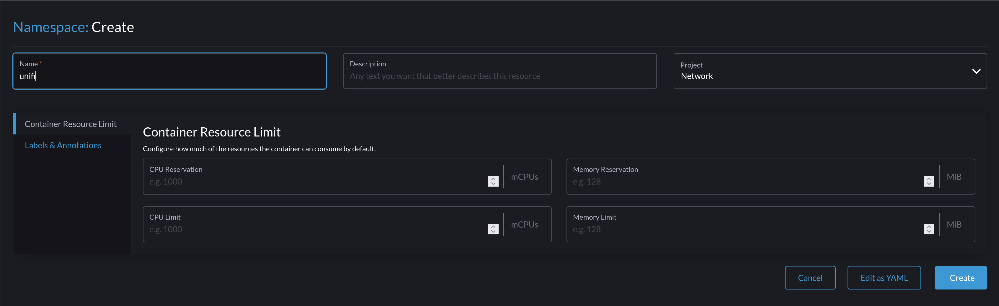

Once created we can go ahead and begin creating our app. Click on Workload and select StatefulSets then click the Create button.

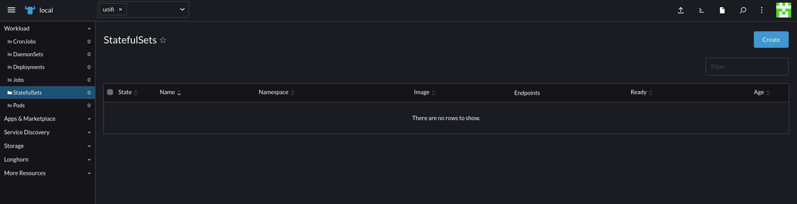

Here there is quite a bit to fill out. Here's the data we need to put in:

```shellscript
 - Name: unifi-controller
 - Container Name: unifi-controller
 - Image: linuxserver/unifi-controller
 - Pull Policy: IfNotPresent
```

We also need to add a bunch of ports.

```shellscript
 - 3478 UDP
 - 10001 UDP
 - 8080 TCP
 - 8081 TCP
 - 8443 TCP
 - 8843 TCP
 - 8880 TCP
 - 6789 TCP
```

We don't need to name these or create a service just yet. We are going to create our service in a bit. We now need to add some environment variables.

```shellscript
 - Key Pair: MEM_LIMIT: 1024M
 - Key Pair: PGID: 1000
 - Key Pair: PUID: 1000
```

We also need to ensure we create our pvc in the menus. Once everything is filled out we can click create. This takes a bit and we can monitor progress in the log viewer.

#### Installing from CLI

This is my prefered method. We need to create 4 files. We could do it all in 1 but I like having 4 in case I need to make updates or changes. I can then just reapply the one. Anyway, first let's create our pvc. 

```yaml
---
apiVersion: v1
kind: PersistentVolume
metadata:
  name: "unifi"
spec:
  storageClassName: "longhorn"
  capacity:
    storage: "2Gi"
  accessModes:
    - ReadWriteOnce
---
```

Alright, now let's build our service manifest.

```yaml
apiVersion: v1
kind: Service
metadata:
  creationTimestamp: null
  labels:
    app: unifi-controller
  name: unifi-controller
spec:
  ports:
    - name: "3478"
      port: 3478
      protocol: UDP
      targetPort: 3478
    - name: "10001"
      port: 10001
      protocol: UDP
      targetPort: 10001
    - name: "8080"
      port: 8080
      targetPort: 8080
    - name: "8081"
      port: 8081
      targetPort: 8081
    - name: "8443"
      port: 8443
      targetPort: 8443
    - name: "8843"
      port: 8843
      targetPort: 8843
    - name: "8880"
      port: 8880
      targetPort: 8880
    - name: "6789"
      port: 6789
      targetPort: 6789
  selector:
    app: unifi-controller
  externalIPs:
    - "192.168.1.249"
```

You can set the externalIP to your choosing. Finally, let's build our statefulset deployment. 

```yaml
apiVersion: apps/v1
kind: StatefulSet
metadata:
  labels:
    app: unifi-controller
  name: unifi-controller
spec:
  replicas: 1
  serviceName: unifi-controller
  selector:
    matchLabels:
      app: unifi-controller
  template:
    metadata:
      creationTimestamp: null
      labels:
        app: unifi-controller
    spec:
      containers:
        - env:
            - name: MEM_LIMIT
              value: 1024M
            - name: PGID
              value: "1000"
            - name: PUID
              value: "1000"
          image: linuxserver/unifi-controller
          name: unifi-controller
          ports:
            - containerPort: 3478
              protocol: UDP
            - containerPort: 10001
              protocol: UDP
            - containerPort: 8080
            - containerPort: 8081
            - containerPort: 8443
            - containerPort: 8843
            - containerPort: 8880
            - containerPort: 6789
          volumeMounts:
            - mountPath: /config
              name: unifi
      restartPolicy: Always
      volumes:
        - name: unifi
          persistentVolumeClaim:
            claimName: unifi
```

Now that these are all created we can deploy them. If you are like me and have all of these in one folder without other manifests we can apply them with one short command...

```shellscript
kubectl apply -f . --namespace unifi
```

If you have a bunch of manifests you need to specify each with -f

```shellscript
kubectl apply -f file1.yml -f file2.yml -f file3.yml -f file4.yml --namespace unifi
```

We can of course watch the deployment with 

```shellscript
kubectl get all -n unifi -o wide
```

Once everything is deployed we can browse to our externalIP on port 8443 and configure the app. If you want to setup an ingress with a custom name as we did with pihole and rancher you want to specify your ingress IP for external IP. In my case that is 192.168.1.200 but I am fine with it like this. If you want the custom ingress you can either do this in rancher in the ingress section or with a manifest

```yaml
apiVersion: networking.k8s.io/v1beta1
kind: Ingress
metadata:
  name: unifi-controller
spec:
  rules:
    - host: unifi.whateverdomain.something
      http:
        paths:
          - path: /
            backend:
              serviceName: unifi-controller
              servicePort: 8443
```

### Traefik Dashboard

This is a bonus section!! I was having some issues with ingress of my unifi container and I found that it was a certificate thing. To save you some time, you need to add --insecureSkipVerify=true to your traefik deployment. Anyway, let's get started!

We need to edit the file /var/lib/rancher/k3s/server/manifests/traefik.yaml

```shellscript
sudo nano /var/lib/rancher/k3s/server/manifests/traefik.yaml
```

From here we need to add the following lines:

```shellscript
dashboard.enabled: "true"
dashboard.domain: some.domain.homelab
```

In that section is where we would also add our line mentioned before. Save this file and deploy it with kubectl apply and we are good to go.

### Conclusion

Our K3S cluster is performing some work for us finally! This is awesome! I encourage you to browse around Longhorn and Rancher to view things and get comfortable. The Traefik dashboard is a great place to learn also! In the next part we will add more services to our cluster and a minecraft server! Happy hacking!

References:
 + <https://rancher.com/>
 + <https://rancher.com/docs/rancher/v2.5/en/installation/install-rancher-on-k8s/>
 + <https://rancher.com/docs/k3s/latest/en/installation/kube-dashboard/>
 + <https://rancher.com/docs/k3s/latest/en/backup-restore/>
 + <https://longhorn.io/>
 + <https://rancher.com/products/longhorn>
 + <https://metallb.org/>
 + <https://cert-manager.io/>
 + <https://storj.io>